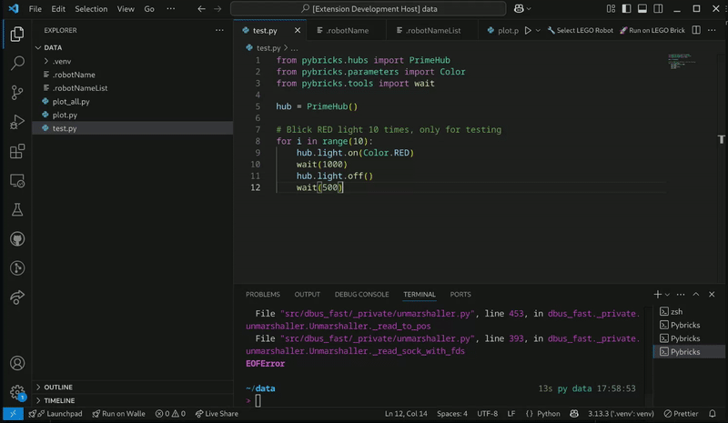
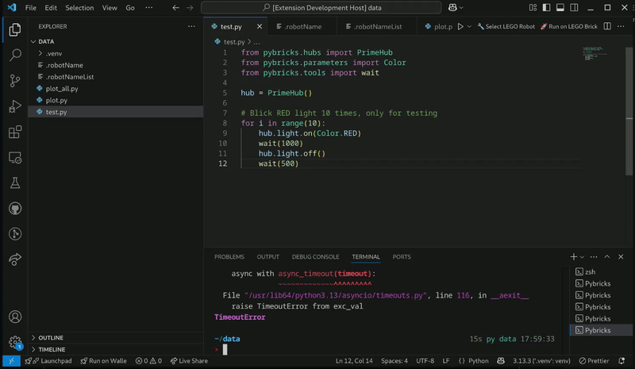

# Pybricks Runner for VSCode

[](https://marketplace.visualstudio.com/items?itemName=AnandSingh.pybricks-runner)


[](https://opensource.org/licenses/MIT)


<p align="center">
  
</p>

**Pybricks Runner** is an VSCode extension that allows you to easily program and run your LEGO SPIKE Prime, EV3, and other Pybricks-compatible bricks directly from Visual Studio Code using the `pybricksdev` command-line tool.

## Features

- **One-click programming:** Easily program your LEGO brick directly from the VSCode editor.
- **Simple integration:** Runs the `pybricksdev run` command directly in the integrated VSCode terminal.
- **Immediate feedback:** Quickly see output and errors directly within VSCode.
- **Remote workspace support:** Works seamlessly with SSH, WSL, and Dev Container workspaces - automatically syncs files from remote to local machine for Bluetooth connectivity.
- **Multi-file projects:** Supports projects with multiple Python files and local imports - directory structure is maintained automatically.

## Screenshots


## 🎥 Demo

### 🚀 Flash Your Robot



1. Open a `.py` file (e.g. `main.py`)
2. Click the 🚀 `Run on <RobotName>` button in the status bar
3. The terminal launches and executes:
   ```bash
   pybricksdev run ble --name "YourRobot" main.py


### ⚙️ Select or Change Robot Name



1. Click the ⚙️ `Select or Change Robot` button top right or Press Ctrl+Shift+P → Select LEGO Robot
2. Choose from the saved list or select "Custom..." to add a new robot
3. Robot names are saved automatically
4. Status bar updates instantly


## Prerequisites

- [Visual Studio Code](https://code.visualstudio.com/)
- **Python 3.8 or higher** installed on your **local machine**
- **pybricksdev** installed on your **local machine** where your Bluetooth hardware is connected

**Important:** Even when using remote workspaces (SSH/WSL/Dev Containers), pybricksdev must be installed **locally** on the machine where your SPIKE Prime hub connects via Bluetooth.

---

## 📦 Installing pybricksdev (Required)

### **🚀 Easy Install (Recommended for Students)**

We provide simple installers that you can just double-click - no command line needed!

#### **macOS**

1. **Download the extension** (if not already installed)
2. **Open the installers folder:**
   - Find the extension folder: `~/.vscode/extensions/anandsingh.pybricks-runner-*/installers/`
   - Or click "Easy Install" when the extension shows the setup message
3. **Double-click** `install-macos.command`
4. **Follow the prompts** - it will automatically:
   - Check if Python is installed
   - Create a virtual environment
   - Install pybricksdev
   - Set up everything for you!

#### **Windows**

1. **Download the extension** (if not already installed)
2. **Open the installers folder:**
   - Find the extension folder: `%USERPROFILE%\.vscode\extensions\anandsingh.pybricks-runner-*\installers\`
   - Or click "Easy Install" when the extension shows the setup message
3. **Double-click** `install-windows.bat`
4. **Follow the prompts** - it will automatically:
   - Check if Python is installed
   - Create a virtual environment
   - Install pybricksdev
   - Set up everything for you!

**Note:** If Python is not installed, the installer will guide you to download it from [python.org](https://www.python.org/downloads/)

---

### **💻 Manual Install (Advanced Users)**

If you prefer to install manually or already have Python set up:

#### **macOS / Linux**

```bash
pip install pybricksdev
# or
pip3 install pybricksdev

# Verify installation
pybricksdev --version
```

**Troubleshooting macOS:**
- If `pip` is not found, install Python from [python.org](https://www.python.org/downloads/)
- If you get permission errors, use: `pip install --user pybricksdev`
- If command not found after install, add to PATH:
  ```bash
  export PATH="$HOME/Library/Python/3.x/bin:$PATH"
  ```
  (Add this line to `~/.zshrc` or `~/.bash_profile` to make it permanent)

#### **Windows**

```cmd
pip install pybricksdev
# or
python -m pip install pybricksdev

# Verify installation
pybricksdev --version
```

**Troubleshooting Windows:**
- If `pip` is not found, install Python from [python.org](https://www.python.org/downloads/) and check "Add Python to PATH" during installation
- If you get permission errors, try running Command Prompt as Administrator
- If command not found after install, add Python Scripts folder to PATH:
  - Search for "Environment Variables" in Windows
  - Add `C:\Users\YourUsername\AppData\Local\Programs\Python\Python3x\Scripts` to PATH

---

### **Verify Bluetooth Connectivity**

After installing pybricksdev, test if your hub is detected:

```bash
pybricksdev devices
```

This should list your SPIKE Prime or other LEGO hubs if they're turned on and Bluetooth is enabled.

---

## 🛠️ Extension Installation

### 🧩 From VS Code Marketplace (Recommended for VS Code)

Install directly from the Visual Studio Code Marketplace:

[](https://marketplace.visualstudio.com/items?itemName=AnandSingh.pybricks-runner)

1. Open VS Code
2. Go to Extensions (`Ctrl+Shift+X`)
3. Search for `pybricks-runner`
4. Click **Install**

---

### 🌐 From Open VSX (For VSCodium, code-server, Theia, etc.)

Install from Open VSX:

[](https://open-vsx.org/extension/AnandSingh/pybricks-runner)


### Manual Installing for development

1. Clone or download this repository:

```bash
git clone https://github.com/yourusername/pybricks-runner-vscode.git
```

2. Open the folder in VSCode:

```bash
cd pybricks-runner-vscode
code .
```

3. Install dependencies and package the extension:

```bash
npm install -g vsce
npm install
vsce package
```

4. Install as below 
```
code --install-extension pybricks-runner-<version>.vsix
```

Or Install the `.vsix` extension file from VSCode:
   - Open VSCode
   - Go to Extensions (`Ctrl+Shift+X`)
   - Click on `...` and select "Install from VSIX"
   - Select the generated `.vsix` file

---

## Usage

- Open a Python (`.py`) file intended for LEGO Pybricks.
- Click on the "🚀 Run on LEGO Brick" button at the top right corner.

The extension will execute:
```bash
pybricksdev run yourfile.py
```

## 🌐 Remote Workspace Support

This extension fully supports remote development environments including:

- **SSH Remote:** Connect to remote servers while programming locally
- **WSL (Windows Subsystem for Linux):** Develop in Linux while flashing from Windows
- **Dev Containers:** Work in containerized environments seamlessly

### How It Works

When you're using a remote workspace:

1. The extension automatically detects the remote environment
2. When you click "Run on Robot", it syncs **all Python files** from your remote workspace to your local machine's temp directory (`/tmp/pybricks-runner` on Mac/Linux or `%TEMP%\pybricks-runner` on Windows)
3. Directory structure is maintained, so **local imports work correctly**
4. Runs `pybricksdev` **locally** (not in the remote terminal) with the synced files
5. Your SPIKE Prime connects via Bluetooth to your local machine
6. Output appears in the **Pybricks Runner** sidebar under "Logs" (not in the terminal)

**Multi-File Projects Supported:**
If your project has multiple Python files with imports like:
```python
from pybricks.hubs import PrimeHub
from my_helpers import move_forward  # Local import
from utils.constants import SPEED    # Local import from subfolder
```
The extension automatically syncs all `.py` files while maintaining your project structure, so all imports work seamlessly!

**Note:** For local workspaces, output still appears in the integrated terminal as usual.

### Setup Requirements

**No additional setup required!** The extension handles everything automatically. Just ensure:

✅ `pybricksdev` is installed on your **local machine** (where your laptop's Bluetooth is)
✅ Your SPIKE Prime hub is paired with your **local machine**
✅ Bluetooth is enabled on your **local machine**

The remote machine doesn't need pybricksdev installed since the extension runs locally.

### Supported Platforms

- ✅ **Windows:** Full support (SSH, WSL, Dev Containers)
- ✅ **macOS:** Full support (SSH, Dev Containers)
- ✅ **Linux:** Full support (SSH, Dev Containers)

## 🧩 Troubleshooting

### **Error: 'pybricksdev: command not found'**

This means pybricksdev is not installed on your **local machine**. Follow these steps:

**On macOS/Linux:**
```bash
# Install pybricksdev
pip install pybricksdev

# Or with pip3
pip3 install pybricksdev

# Verify it's installed
pybricksdev --version
```

**On Windows:**
```cmd
# Install pybricksdev
pip install pybricksdev

# Or with python -m pip
python -m pip install pybricksdev

# Verify it's installed
pybricksdev --version
```

If still not working after installation:
- **macOS/Linux:** Check if Python's bin directory is in your PATH
- **Windows:** Restart VSCode after installation, or add Python Scripts folder to PATH
- See detailed installation instructions above

---

### **Robot not connecting**

- Ensure Bluetooth is enabled on your **local machine**
- Turn on your SPIKE Prime hub
- Run `pybricksdev devices` in terminal to check if the hub is detected
- Try re-pairing the hub via your OS Bluetooth settings

---

### **Remote Workspace Issues**

- Extension must run locally - check that `"extensionKind": ["ui"]` is set in package.json
- pybricksdev must be installed on your local machine, NOT the remote machine
- Check the "Pybricks Runner" sidebar "Logs" view for output when using remote workspaces

---

### **Web Bluetooth not available**

- Check if you're using a Chromium browser and have enabled the `chrome://flags/#enable-web-bluetooth` flag
- Web Bluetooth only works in secure contexts (HTTPS or localhost)


---

## Requirements

- Node.js LTS (18.x recommended)
- Python installed and configured (`pybricksdev`)
- Supported LEGO hardware (EV3, SPIKE Prime, etc.)

---

## ✅ Web Bluetooth Setup for VSCode & code-server:

To enable Web Bluetooth:

1. **Open Chrome Flags**:  
   Go to `chrome://flags/#enable-web-bluetooth` and set it to **Enabled**.

2. **Use HTTPS or localhost**:  
   Web Bluetooth only runs in secure contexts.

3. **Browser Compatibility**:  
   Ensure you're using a Chromium-based browser (**Chrome, Edge**).

After enabling the flag, reload your VSCode web interface. Web Bluetooth functionality will then be available and reliable.


## 🙌 Contributing

Contributions are welcome! Feel free to open issues, submit pull requests, or suggest enhancements.

1. Fork this repository.
2. Create your feature branch: `git checkout -b my-new-feature`
3. Commit your changes: `git commit -am 'Add some feature'`
4. Push to the branch: `git push origin my-new-feature`
5. Submit a pull request.

---

## 📜 License

Distributed under the MIT License. See `LICENSE` for more information.

---

**Happy Building!**