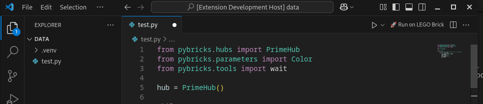

# Pybricks Runner for VS Code

[](https://marketplace.visualstudio.com/items?itemName=AnandSingh.pybricks-runner)


[](https://opensource.org/licenses/MIT)

<p align="center">
  
</p>

**Pybricks Runner** is a VS Code extension that allows you to easily program and run your LEGO SPIKE Prime, EV3, and other Pybricks-compatible robots directly from Visual Studio Code using the `pybricksdev` command-line tool.

**[Install from VS Code Marketplace →](https://marketplace.visualstudio.com/items?itemName=AnandSingh.pybricks-runner)**

## Features

- **One-click programming:** Run your Python code on LEGO robots with a single click
- **Activity bar integration:** Dedicated sidebar with device management
- **Device scanning:** Automatically detect nearby LEGO robots
- **Simple integration:** Uses the `pybricksdev` CLI tool via VS Code terminal
- **Immediate feedback:** See output and errors directly in the integrated terminal
- **Easy robot selection:** Quickly switch between different robots

## Screenshots



## Prerequisites

- [Visual Studio Code](https://code.visualstudio.com/)
- **Python 3.8 or higher** installed on your machine
- **pybricksdev** installed on your machine
- **Bluetooth enabled** on your computer

## Installing pybricksdev

### macOS / Linux

```bash
pip install pybricksdev
# or
pip3 install pybricksdev

# Verify installation
pybricksdev --version
```

### Windows

```cmd
pip install pybricksdev
# or
python -m pip install pybricksdev

# Verify installation
pybricksdev --version
```

### Verify Bluetooth Connectivity

After installing pybricksdev, test if your hub is detected:

```bash
pybricksdev devices
```

This should list your SPIKE Prime or other LEGO hubs if they're turned on and Bluetooth is enabled.

## Installation

### From VS Code Marketplace (Recommended)

**Install directly from:** [VS Code Marketplace](https://marketplace.visualstudio.com/items?itemName=AnandSingh.pybricks-runner)

Or install within VS Code:

1. Open VS Code
2. Go to Extensions (`Ctrl+Shift+X` / `Cmd+Shift+X`)
3. Search for `pybricks-runner`
4. Click **Install**

### From VSIX File

1. Download the `.vsix` file from [Releases](https://github.com/AnandSingh/pybricks-runner-vscode/releases)
2. In VS Code, go to Extensions (`Ctrl+Shift+X` / `Cmd+Shift+X`)
3. Click `...` → `Install from VSIX...`
4. Select the downloaded `.vsix` file

## Usage

### Running Your Program

1. Open a Python (`.py`) file for Pybricks
2. Click the **🚀 Run on LEGO Brick** button in the editor title bar (top right)
   - Or click the status bar button (bottom left)
   - Or use Command Palette: `Pybricks: Run on Robot`
3. The terminal will open and execute: `pybricksdev run ble --name "YourRobot" yourfile.py`

### Using the Sidebar

1. Click the **Pybricks** icon in the Activity Bar (left sidebar)
2. View the **Devices** panel to see:
   - Currently selected robot
   - Available devices (click refresh to scan)
3. Click on a device to select it

### Selecting a Robot

**Method 1: Via Sidebar**
- Click the Pybricks icon in the Activity Bar
- Click on any device in the "Devices" view to select it

**Method 2: Via Command**
1. Click the **🔧 Select LEGO Robot** button in the editor title bar
2. Choose from the saved list or select "Custom..." to add a new robot
3. Enter your robot's name (e.g., `Pybricks`, `SPIKE`, `MyRobot`)

## Troubleshooting

### Error: 'pybricksdev: command not found'

This means pybricksdev is not installed. Install it with:

```bash
pip install pybricksdev
```

If still not working:
- **macOS/Linux:** Check if Python's bin directory is in your PATH
- **Windows:** Restart VS Code after installation, or add Python Scripts folder to PATH

### Robot not connecting

- Ensure Bluetooth is enabled on your computer
- Turn on your SPIKE Prime hub
- Click the refresh button in the Devices sidebar to scan
- Run `pybricksdev devices` in terminal to check if the hub is detected
- Try re-pairing the hub via your OS Bluetooth settings

### Devices not showing in sidebar

- Click the refresh button in the Devices panel
- Make sure pybricksdev is installed correctly
- Ensure Bluetooth is enabled
- Make sure your robot is turned on and nearby

## Contributing

Contributions are welcome! Feel free to open issues or submit pull requests.

1. Fork this repository
2. Create your feature branch: `git checkout -b my-feature`
3. Commit your changes: `git commit -am 'Add feature'`
4. Push to the branch: `git push origin my-feature`
5. Submit a pull request

## License

Distributed under the MIT License. See `LICENSE` for more information.

---

**Happy Building!**
